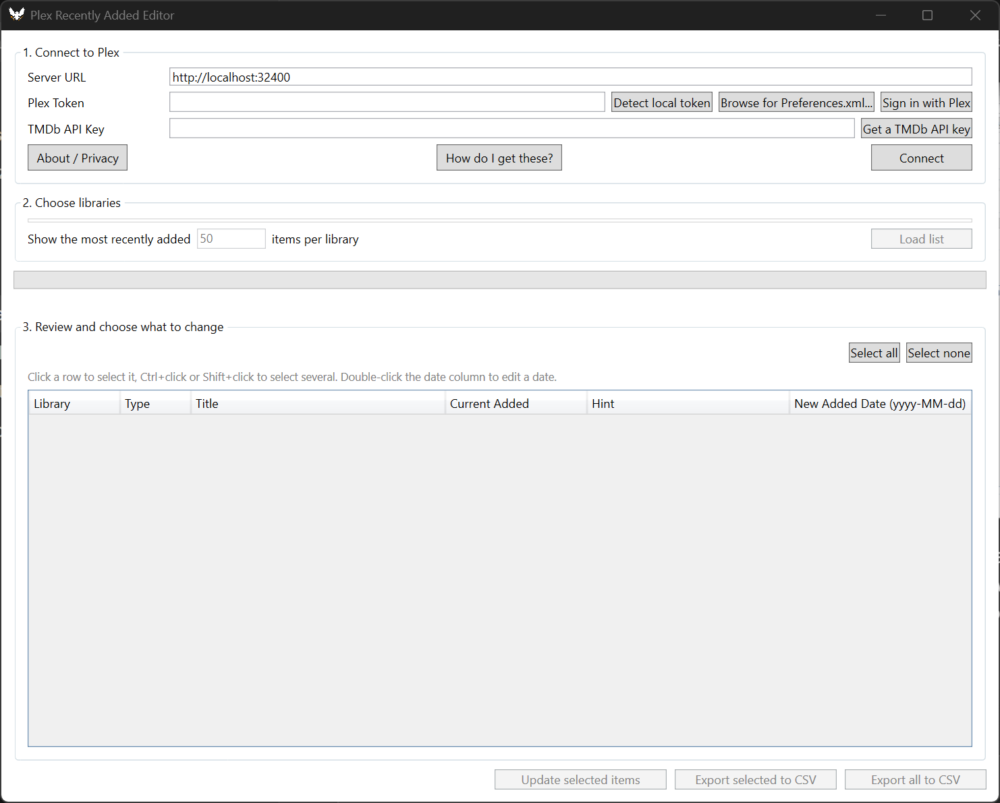

# Plex Recently Added Editor

A small Windows app for cleaning up Plex's "Recently Added" feed by hand.



## Why this exists

If you run Tdarr, Sonarr, or Radarr against a library that already exists, you've probably
seen this: a movie you added years ago suddenly shows up in Recently Added again, because
something rewrote the file on disk (a re-encode, a folder reorg, a quality upgrade) and Plex's
scanner treated it as a new addition. Multiply that by a few thousand titles and Recently
Added stops being useful.

There's no automatic fix here, and deliberately so - trying to guess which "recently added"
items are real and which aren't is a good way to accidentally hide something you actually just
added. Instead, this app pulls the last N items from each of your libraries, shows you a
release-date/air-date suggestion for each one, and lets you pick exactly which ones to correct.
You stay in control of every change.

## Features

- Connects to any Plex server - local or remote
- Shows the most recently added movies/episodes per library, with the ability to select
  individual rows (click, Ctrl+click, Shift+click) rather than everything at once
- Suggests a corrected date per item using TMDb's release date (movies) or air date
  (episodes), which you can edit before applying
- Flags items that are already marked watched, or that landed on the same day as a large
  batch of otherwise-unrelated titles - both are common signs of a false "recently added"
  rather than a real one, shown as a hint, not auto-applied
- Export the full list or just what you've selected to CSV
- Writes a report of what changed after every update
- No telemetry of any kind - see [SECURITY.md](SECURITY.md)

## Getting started

1. Download the latest release from the [Releases](../../releases) page and run it - no
   installer, no .NET runtime to install separately.
2. Connect: enter your Plex server URL, then either sign in with Plex, let it auto-detect a
   token from a local Plex Media Server install, or browse for your `Preferences.xml`
   directly. Add a free [TMDb](https://www.themoviedb.org/settings/api) API key if you want
   suggested dates filled in automatically. The in-app "How do I get these?" button walks
   through all of this with clickable links.
3. Pick which libraries to look at and how many recent items to pull per library, then
   click "Load list".
4. Select the rows you actually want to fix, adjust the date if you want something other
   than the suggestion, then click "Update selected items" - or export to CSV first if you'd
   rather just review offline.

## Building from source

Requires the [.NET 8 SDK](https://dotnet.microsoft.com/download).

```
dotnet build
```

To produce the same kind of self-contained single-file exe as the releases:

```
dotnet publish src/PlexRecentlyAddedEditor/PlexRecentlyAddedEditor.csproj -c Release -r win-x64 --self-contained true -p:PublishSingleFile=true
```

## Privacy & security

This app doesn't collect or transmit anything beyond what's needed to talk to your own Plex
server, plex.tv (only for sign-in), and TMDb (only if you provide a key). Full details,
including exactly what network calls it makes and why, are in [SECURITY.md](SECURITY.md).

## Contributing

Issues and pull requests are welcome. It's a small WPF/.NET app with no exotic dependencies -
`Models/` holds the data shapes, `Services/` holds the Plex/TMDb/report logic, and the rest is
the UI. If you're planning a larger change, opening an issue first to talk it through is
appreciated.

## Credits

This started as a couple of PowerShell scripts to work around a Tdarr/Plex annoyance, and grew
into this app through a lot of back-and-forth with Claude (Anthropic) as a coding partner -
tracking down why Plex was misbehaving in the first place, then building and iterating on the
actual tool.

## License

[MIT](LICENSE)
